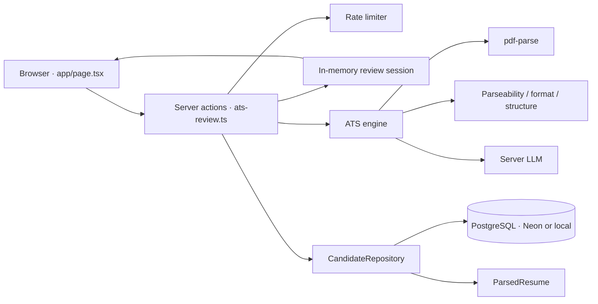

# Triage — ATS AI Reviewer

🔗 **Live demo:** https://unthinkable-triage.vercel.app

Production ATS for screening PDF resumes against a job requisition. The browser uploads resumes; the server extracts text, scores each candidate with a constrained LLM plus rule-based analyzers, persists results, and streams ranking back to the dashboard.

**Stack:** Next.js 16 · React 19 · TypeScript · Prisma 7 (PostgreSQL) · OpenAI-compatible LLM

---

## Architecture



| Layer | Path | Responsibility |
|---|---|---|
| UI | `app/page.tsx`, `components/ats/` | Job CRUD, PDF upload, live progress, ranking, candidate detail |
| Server actions | `src/actions/ats-review.ts` | Queue resumes, run scoring in `after()`, poll progress |
| Session | `lib/ats-session.ts` | In-memory `Map` for the in-flight batch (not persisted) |
| Engine adapter | `lib/ats-engine.ts` | Server LLM config + per-resume quota |
| Scoring engine | `src/ats-engine/` | Extract → analyze → validate → weighted score → decision band |
| Persistence | `src/repositories/candidate.repository.ts` | Candidate, application, and parsed-resume writes |
| Database | `prisma/schema.prisma` | `Job`, `Candidate`, `ParsedResume`, `Application` |

Credentials never leave the server. Provider keys are configured in `.env` (see `.env.example`).

### Request flow

1. Recruiter picks a job, attaches PDFs (or uses local `data/generated-resumes`).
2. `startAtsReview` peeks the IP quota, creates a session, then `after()` scores every resume in parallel.
3. Each resume: extract text → rule analyzers → LLM JSON → verify claimed skills against resume text → weighted 0–100 score.
4. Result is mapped to a UI tier. Postgres stores the **application** (score for that job) and a **parsed resume** (extracted text + structured parse, keyed by SHA-256 of the file bytes). Writes fall back in-memory if the DB is down.
5. The client polls `getAtsReviewProgress` every 800ms, then loads the ranked roster. Reloaded results read extracted text from `ParsedResume`, not from the score summary.

### Scoring (screening defaults)

| Component | Weight |
|---|---|
| Skills | 30% |
| Experience | 20% |
| Resume quality | 20% |
| Domain / keyword | 10% |
| Semantic (LLM) | 10% |
| Education | 10% |

Penalties cap at 30 points (missing must-have skills, experience gap, seniority mismatch, poor ATS format). Decision bands: **≥85** strong · **≥70** good · **≥55** moderate · else no match. UI tiers: `top` / `qualified` / `maybe` / `unqualified` / `rejected`.

Rate limits (production, per IP): 10 / 10 min, 30 / hour, 80 / day. Concurrency 1; 400ms minimum between inferences.

---

## System prompt

The production analyzer lives in `src/ats-engine/analyzers/llm-analysis.ts`. Temperature `0.1`, `max_tokens` 2000, `response_format: json_object`. Skills that are not explicit in the resume are dropped after the model returns.

```
system prompt = `You are an ATS (Applicant Tracking System) analyzer. Analyze resumes against job descriptions.

RULES:
1. Only identify skills that are EXPLICITLY mentioned in the resume
2. Do NOT infer or assume skills not stated
3. Be conservative with scores
4. Provide evidence quotes for skills found
5. Output ONLY valid JSON

Your output must match this exact schema:
{
  "semanticScore": <0-100>,
  "skillsMatch": ["<skill1>", "<skill2>"],
  "experienceAlignment": <0-100>,
  "keyFindings": {
    "strengths": ["..."],
    "gaps": ["..."],
    "risks": ["..."]
  },
  "skillsAnalysis": {
    "matched": ["<skill with evidence>"],
    "missing": ["<required but not found>"],
    "inferred": ["<possibly has>"]
  },
  "experienceAnalysis": {
    "totalYears": <number>,
    "relevantYears": <number>,
    "highlights": ["..."]
  },
  "educationAnalysis": {
    "level": "<high school|bachelors|masters|phd|other>",
    "relevance": <0-100>,
    "details": "<field of study>"
  },
  "confidence": <0-1>,
  "reasoning": "<brief explanation>"
}`
```

User message (per resume):

```
user prompt = `Analyze this resume against the job:

=== JOB ===
Title: ${job.title}
Required Skills: ${job.mustHaveSkills.join(", ")}
Nice-to-have: ${job.niceToHaveSkills.join(", ")}
Experience Required: ${job.requiredExperienceYears} years
Level: ${job.experienceLevel}

Description:
${job.description}

=== RESUME ===
${resumeText}

Output JSON only:`
```

If the model’s `confidence` is below 0.3, the engine discards the LLM output and scores from rule-based baselines instead.

---

## Data model

```prisma
model Job {
  id                      String   @id @default(uuid())
  title                   String
  description             String
  slug                    String   @unique
  mustHaveSkills          String[]
  niceToHaveSkills        String[]
  requiredExperienceYears Int
  department              String
  location                String
  locationType            String
  employmentType          String
  salaryMin               Int
  salaryMax               Int
  applicants              Application[]
}

model Candidate {
  id            String         @id @default(uuid())
  name          String
  email         String?
  resumeUrl     String?
  skills        String[]
  experience    Json?
  education     Json?
  applications  Application[]
  parsedResumes ParsedResume[]
}

model ParsedResume {
  id                   String   @id @default(uuid())
  candidateId          String
  contentHash          String   @unique
  fileName             String
  mimeType             String
  extractedText        String
  normalizedText       String?
  skills               Json
  workExperience       Json
  education            Json
  totalYearsExperience Int
  highestSeniority     String?
  source               String
  candidate            Candidate @relation(...)
}

model Application {
  id                String   @id @default(uuid())
  jobId             String
  candidateId       String
  matchScore        Int
  justification     String
  tier              String
  skillMatch        Int
  experienceMatch   Int
  domainFit         Int
  semanticFit       Int
  strengths         String[]
  concerns          String[]
  recommendedAction String
  aiSummary         String?
  fileName          String?
  job               Job       @relation(...)
  candidate         Candidate @relation(...)
}
```

---

## Local setup

Node 20+, pnpm 10+, PostgreSQL. Prisma talks to Postgres through the `pg` adapter (`lib/prisma.ts`). Neon works with the same `DATABASE_URL`.

```bash
pnpm install
cp .env.example .env
npx prisma generate
npx prisma db push
npx prisma db seed
pnpm dev
```

Open http://localhost:3000.

Required env: `DATABASE_URL` and the primary key in `.env.example`. Optional model and fallback keys are documented there.

### Neon

Paste the Neon connection string into `DATABASE_URL` (direct or pooled). Include `sslmode=require`. Then:

```bash
npx prisma db push
npx prisma db seed
```

The `pg` pool enables TLS automatically for `*.neon.tech` and any URL with `sslmode=require`. After you send the Neon URL it can replace the local Docker database without code changes.

Demo PDFs are gitignored. To use “existing resumes” locally, clone them into `data/generated-resumes/`.

```bash
pnpm verify:db   # connectivity check
pnpm studio      # Prisma Studio
```

### Deploy

Import the repo on Vercel (Next.js). Set `DATABASE_URL` and the server AI key from `.env.example`. `postinstall` / `build` already run `prisma generate`.

---

## Layout

```
app/page.tsx                 Dashboard orchestrator
components/ats/              Reviewer UI
src/actions/ats-review.ts    Batch review + job CRUD
src/ats-engine/              Scoring pipeline
lib/ats-engine.ts            LLM provider + throttle wrapper
lib/ats-session.ts           In-flight review state
src/repositories/            Prisma writes
prisma/schema.prisma         Job / Candidate / ParsedResume / Application
```
